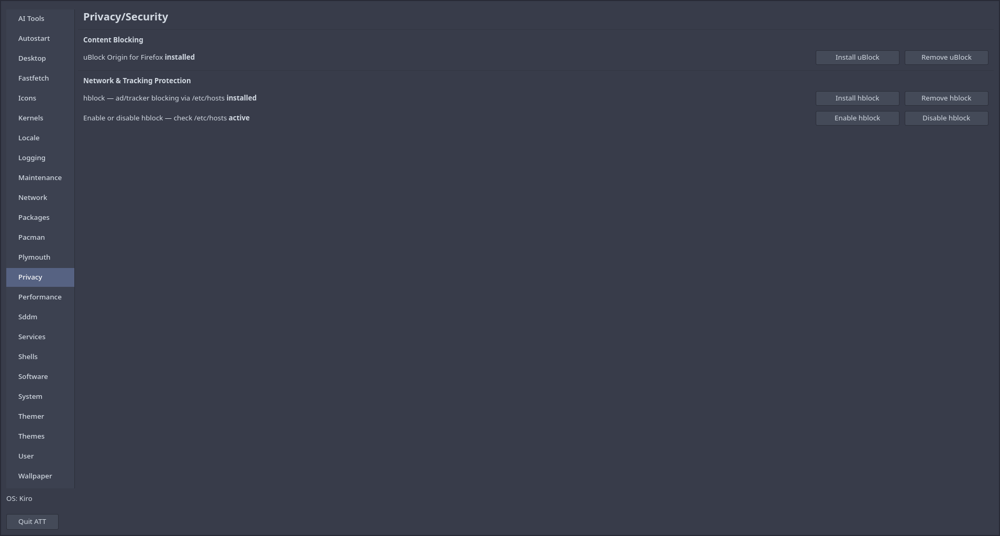
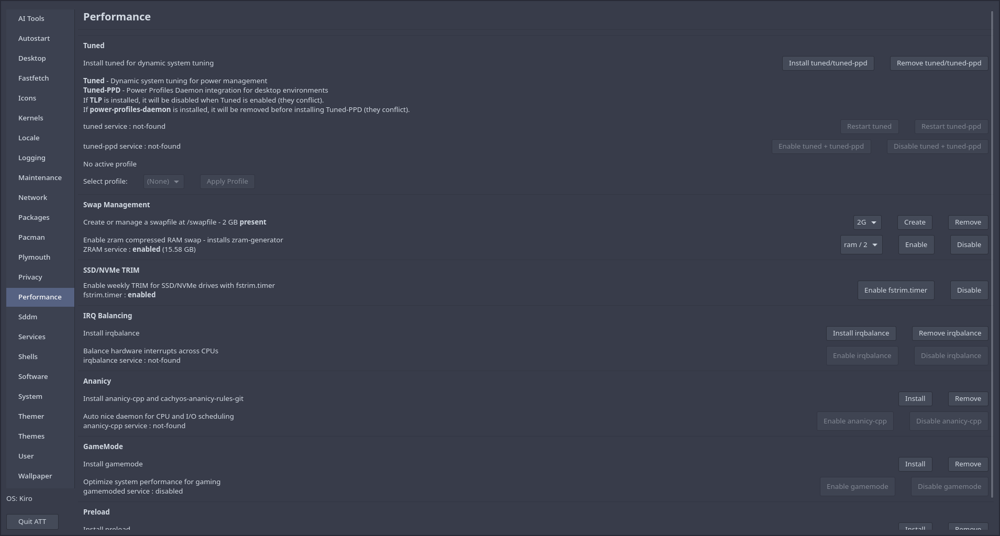
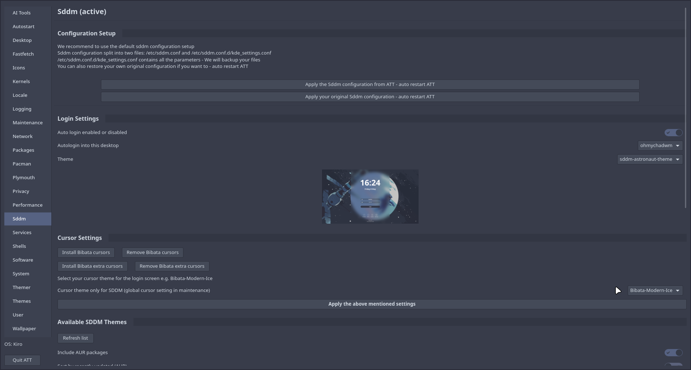
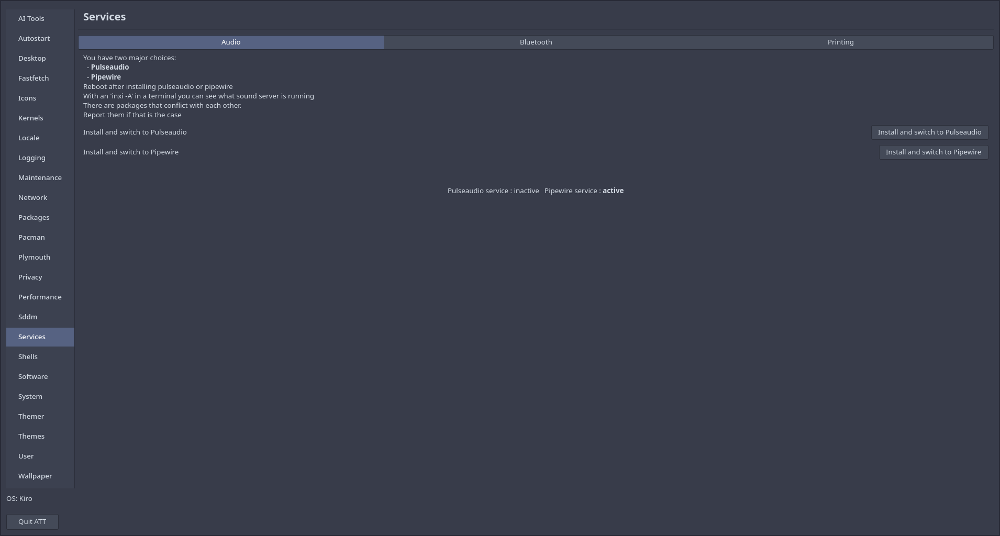
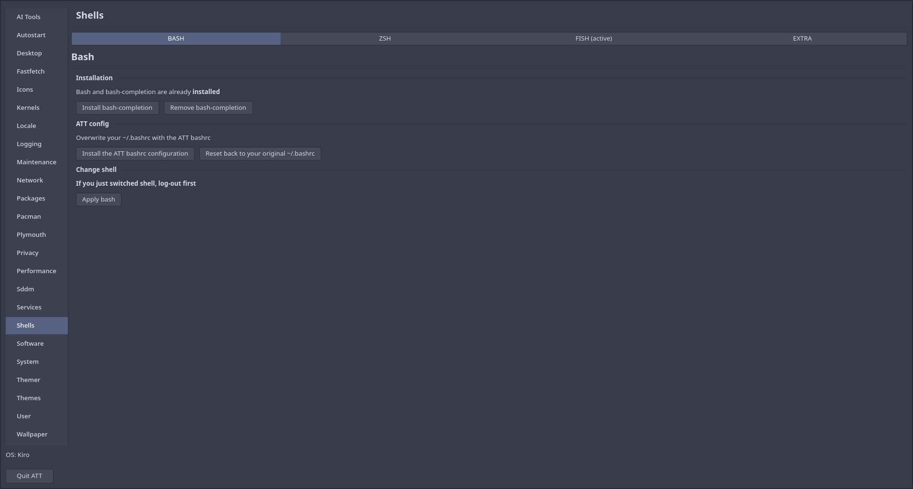
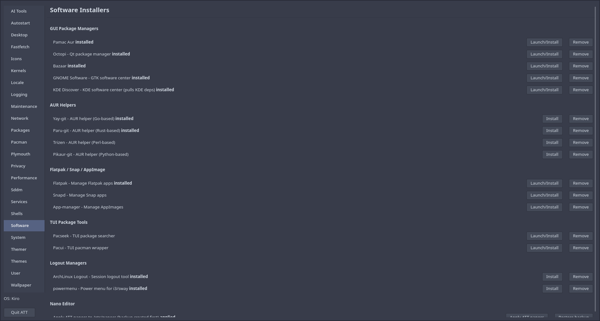
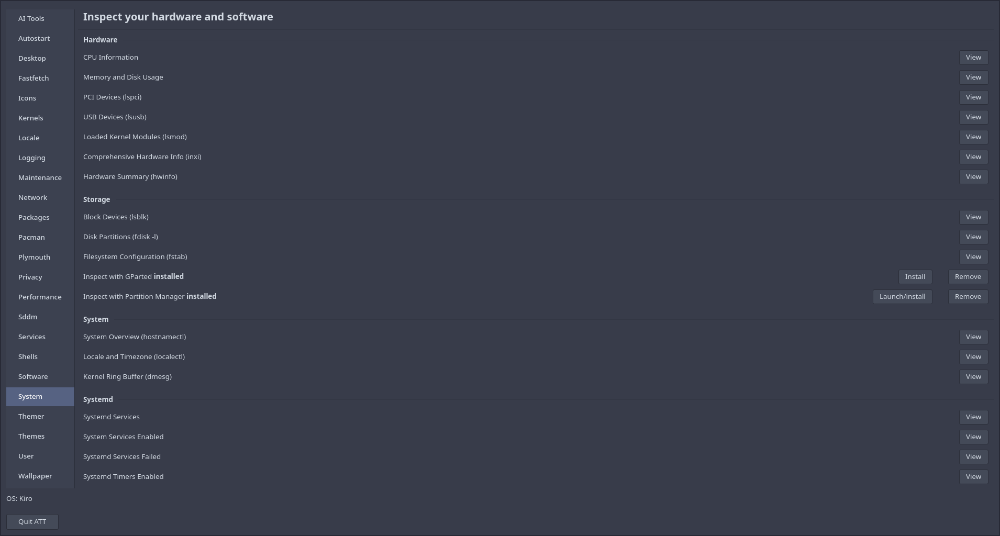
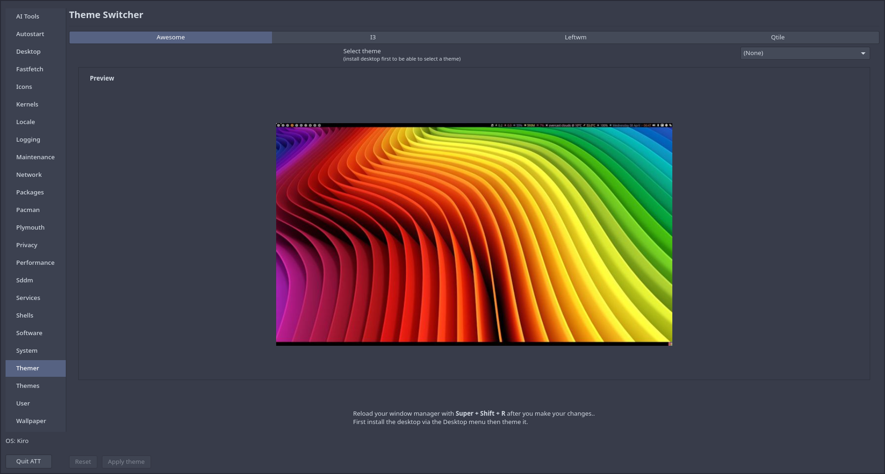
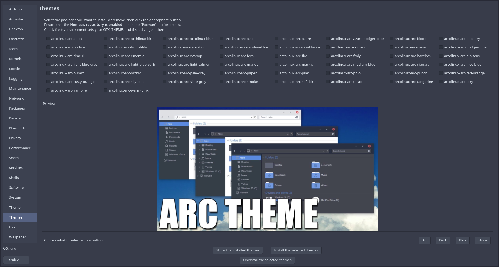
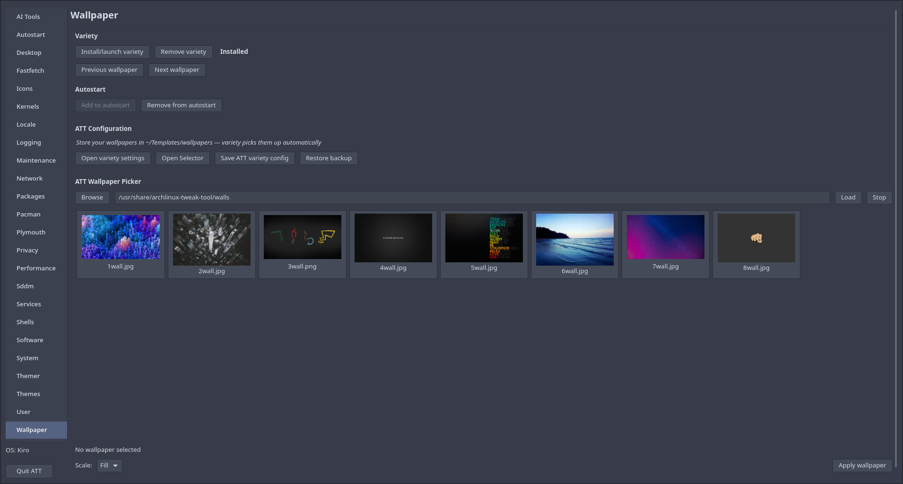

# ArchLinux Tweak Tool (ATT)

A comprehensive, user-friendly graphical application for customizing and maintaining Arch-based Linux systems. ATT provides an intuitive interface to manage system configurations, themes, packages, and services without requiring command-line expertise.

# Installation

Add the nemesis_repo to your /etc/pacman.conf and update your system.

```
[nemesis_repo]
SigLevel = Never
Server = https://erikdubois.github.io/$repo/$arch
```

or you can use this script download it and run it

```
curl -sL bit.ly/nemesis-repo | sudo bash
```

Then install 

```
sudo pacman -S archlinux-tweak-tool-gtk4-git.
```

## Gallery

### Application Screenshots

| | | |
|---|---|---|
|  |  |  |
|  |  |  |
|  |  |  |
|  |  |  |
|  |  |  |
|  |  |  |
|  |  |  |
|  |  |  |

## Overview

ArchLinux Tweak Tool (ATT) is a GTK4-based desktop application designed to simplify system administration and customization for Arch-based Linux distributions. Originally developed for ArcoLinux, ATT now supports numerous Arch-based systems and provides a unified interface for managing various aspects of your Linux system through a graphical user interface.

The tool is written in Python with GTK4 and is built with extensibility and user-friendliness in mind, allowing both novice and experienced users to manage their systems efficiently.

## Key Features

### 🖥️ Desktop Management

- Install and switch desktop environments (KDE, GNOME, Xfce, Hyprland, dwm, and more)
- Supports X11 and Wayland sessions
- Desktop environment-specific configuration

### ⚙️ Kernel Management

- Install and remove kernels with a single click
- Supports mkinitcpio and dracut initramfs generators
- GRUB boot entry integration
- View currently running kernel and all installed options

### 🎬 Boot Splash (Plymouth)

- Install and switch Plymouth boot splash themes
- Bootloader integration for systemd-boot, GRUB, limine, and rEFInd
- Dracut and mkinitcpio hook configuration
- Fix initramfs hooks directly from the UI

### 🔑 Login Manager (SDDM)

- Install and preview SDDM themes
- Configure cursor, wallpaper, session, and display settings
- Sort available themes by recently updated (AUR)
- Fix and apply SDDM configuration

### 💻 Shell Configuration

- Switch default shell between bash, zsh, and fish
- Configure shell environments and themes
- Zsh plugin and theme management

### 🤖 AI Tools

- Claude AI integration for system assistance
- AI-powered help for system configuration and troubleshooting

### 🔒 Privacy & Security

- hBlock integration for DNS-based ad blocking
- Privacy-focused system configuration

### 🔍 System Inspector

- Hardware information overview
- Running services and system journal at a glance
- Real-time system profile

### 🛠️ Software Installers

- Curated installers for commonly used applications
- One-click setup for popular tools and utilities

### 🖼️ Wallpaper Management

- Browse folders and set desktop wallpapers
- Supports all major desktop environments and window managers

### 🎨 Appearance & Themes

- Install and manage GTK and Plasma themes
- Configure icon themes
- Apply coordinated theme sets (GTK + icons + cursor + wallpaper)

### 📦 Package Management

- Export and import installed package lists
- Batch package installation from saved configurations
- Pacman configuration, repo management, and parallel downloads

### 🔧 System Configuration

- **Services**: Enable/disable systemd services
- **Autostart**: Manage applications that launch at login
- **User Management**: Create and configure user accounts
- **Locale**: Set locale, keyboard layout, and timezone

### 🚀 Performance & Optimization

- CPU governor and I/O scheduler tuning
- System performance settings
- Resource utilization optimization

### 🧹 System Maintenance

- Clear orphaned packages
- Find and set best pacman mirrors
- Remove pacman lock files
- System cleanup utilities

### 📊 Logging & Information

- FastFetch configuration for system information display
- ATT session log browser
- Network tools and Samba share configuration

## Supported Distributions

ATT originally developed for **ArcoLinux**, now supports numerous Arch-based distributions:

| Distribution          | Website                       |
|-----------------------|-------------------------------|
| Arch Linux            | https://archlinux.org         |
| ArchBang              | https://archbang.org/         |
| Archcraft             | https://archcraft.io/         |
| Archman               | https://archman.org/          |
| Artix                 | https://artixlinux.org/       |
| Axyl                  | https://axyl-os.github.io/    |
| BerserkerOS           | https://berserkarch.xyz/      |
| BigLinux              | https://www.biglinux.com.br/  |
| BlendOS               | https://blendos.co/           |
| Bluestar              | https://sourceforge.net/projects/bluestarlinux/ |
| CachyOS               | https://cachyos.org/          |
| Calam-arch            | https://sourceforge.net/projects/blue-arch-installer/ |
| Crystal Linux         | https://getcryst.al/          |
| EndeavourOS           | https://endeavouros.com/      |
| Garuda                | https://garudalinux.org/      |
| Liya                  | https://sourceforge.net/projects/liya-2024/ |
| LinuxHub Prime        | https://linuxhub.link/        |
| Mabox                 | https://maboxlinux.org/       |
| Manjaro               | https://manjaro.org/          |
| Nyarch                | https://nyarchlinux.moe/      |
| ParchLinux            | https://parchlinux.ir/        |
| PrismLinux            | https://www.prismlinux.org/   |
| RebornOS              | https://rebornos.org/         |
| StormOS               | https://sourceforge.net/projects/hackman-linux/ |
| XeroLinux             | https://xerolinux.xyz/        |

**Note:** The complete and up-to-date list of supported distributions is maintained in the source code at the beginning of `archlinux-tweaktool.py` file, as new distributions are regularly added during development.

## Pages & Tabs

ATT currently has **24 tabs** (sidebar pages):

| Tab | Contents |
| --- | -------- |
| **AI Tools** | Claude AI integration for system assistance |
| **Autostart** | Manage applications that launch at login |
| **Desktop** | Install and switch desktop environments (KDE, GNOME, XFCE, Hyprland, dwm, and more) |
| **Fastfetch** | Configure fastfetch system-info display and presets |
| **Icons** | Install and manage icon themes |
| **Kernels** | Install and remove kernels; GRUB and dracut/mkinitcpio integration |
| **Locale** | Set locale, keyboard layout, and timezone |
| **Logging** | Browse ATT session logs and system journal entries |
| **Maintenance** | Mirror ranking, orphan package removal, pacman cache cleanup, lock-file removal |
| **Network** | Network tools and Samba share configuration |
| **Packages** | Export and import installed package lists; batch installation from saved configs |
| **Pacman** | pacman.conf settings, repo management, and parallel downloads |
| **Plymouth** | Boot splash theme installation and configuration (mkinitcpio and dracut) |
| **Privacy** | hBlock DNS ad-blocking and privacy-focused system settings |
| **Performance** | CPU governor, I/O scheduler, and system performance tuning |
| **Sddm** | SDDM login manager — themes, cursor, wallpaper, session and display config |
| **Services** | Enable and disable systemd services |
| **Shells** | Switch default shell; configure bash, zsh, and fish environments |
| **Software** | Curated software installers for common applications |
| **System** | System inspector — hardware info, running services, journal overview |
| **Themer** | Apply coordinated desktop theme sets (GTK + icons + cursor + wallpaper) |
| **Themes** | Standalone GTK and Plasma theme management |
| **User** | Create and configure user accounts |
| **Wallpaper** | Browse folders and set desktop wallpapers across all supported DEs/WMs |

## Desktop Environment Support

ATT works with virtually all Arch-based desktop environments, including:
- **X11 Desktop Environments**: KDE Plasma, GNOME, Xfce, LXQt, MATE, Cinnamon, and others
- **Wayland Desktop Environments**: Hyprland, Sway, GNOME (Wayland), KDE Plasma (Wayland), and others

## System Management & Backup

ATT implements automatic backup functionality for system safety:
- Configuration file changes are backed up with `.bak` or `.back` extensions
- Reset buttons utilize backup files to restore previous configurations
- Manual backups can be created before major changes

## Advanced Configuration

### Login Manager Configuration

ATT provides specialized configuration tools for common login managers:

- **SDDM**: Simple Display Manager configuration

Automated fix scripts are available if issues occur:

- `fix-sddm-conf`

### Repository Management

ATT allows you to configure additional package repositories, but caution is recommended as incompatible repositories can cause system conflicts. Always review repository settings carefully before enabling them.

## Requirements

- **Operating System**: Arch Linux or Arch-based distribution
- **Python**: Python 3.x
- **GUI Library**: GTK 4.0
- **Package Manager**: pacman

## Installation

Detailed installation instructions are available in the project's documentation or can be found in the respective distribution's repository.

## Support & Documentation

- **GitHub Repository**: [github.com/erikdubois/archlinux-tweak-tool-gtk4](https://github.com/erikdubois/archlinux-tweak-tool-gtk4)
- **Issue Tracker**: Report bugs and request features on the GitHub repository
- **YouTube Tutorials**: [ArchLinux Tweak Tool Playlist](https://www.youtube.com/playlist?list=PLlloYVGq5pS5nvFc_LYRE82Gh3XWA6rVH)

## Authors

- **Brad Heffernan**
- **Erik Dubois**
- **Cameron Percival**

## Contributing

Contributions are welcome! If you encounter issues or want to add support for additional distributions or features, please:
1. Check the GitHub repository for existing issues
2. Create a detailed bug report or feature request
3. Submit pull requests with improvements

## License

Please refer to the LICENSE file in the repository for licensing information. 

---

**Note**: This tool requires administrative privileges (sudo/pkexec) to modify system configurations. Always ensure you understand the changes being made to your system configuration.