# ArchLinux Tweak Tool (ATT)

A comprehensive, user-friendly graphical application for customizing and maintaining Arch-based Linux systems. ATT provides an intuitive interface to manage system configurations, themes, packages, and services without requiring command-line expertise.

# Installation

Add the nemesis_repo to your /etc/pacman.conf and update your system.

Then install 

```
sudo pacman -S archlinux-tweak-tool-gtk4-git.
```

```
[nemesis_repo]
SigLevel = Never
Server = https://erikdubois.github.io/$repo/$arch
```

## Gallery

### Application Screenshots

| | |
|---|---|---|
| 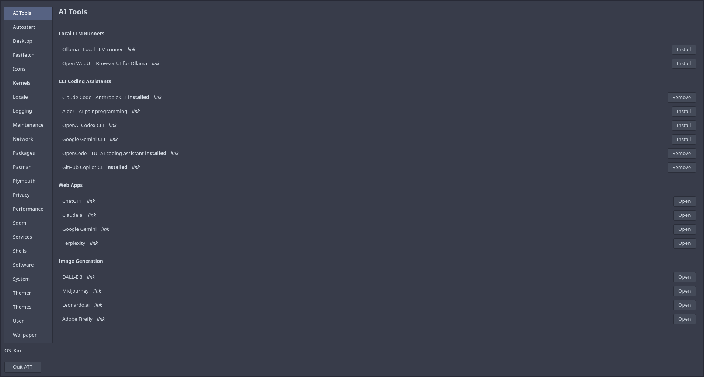 | 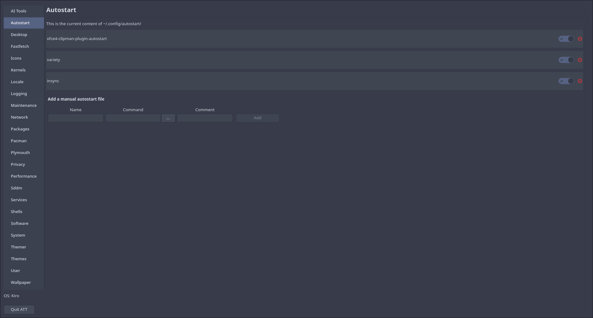 | 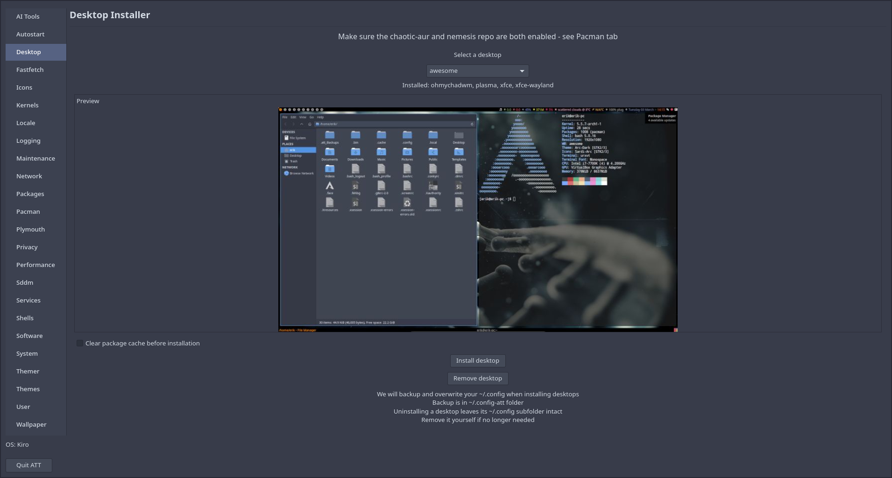 |
| 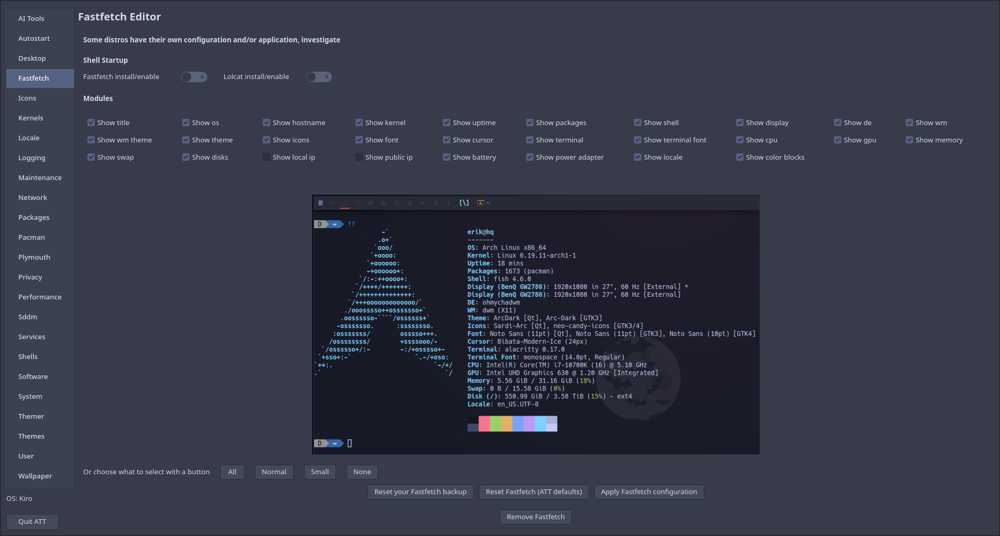 | 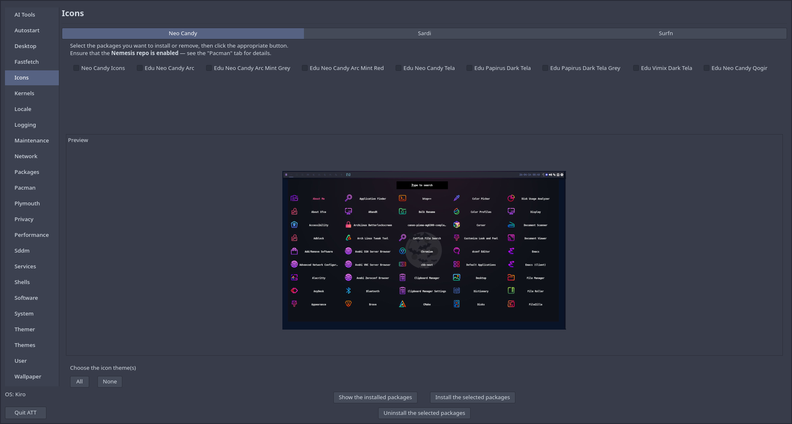 | 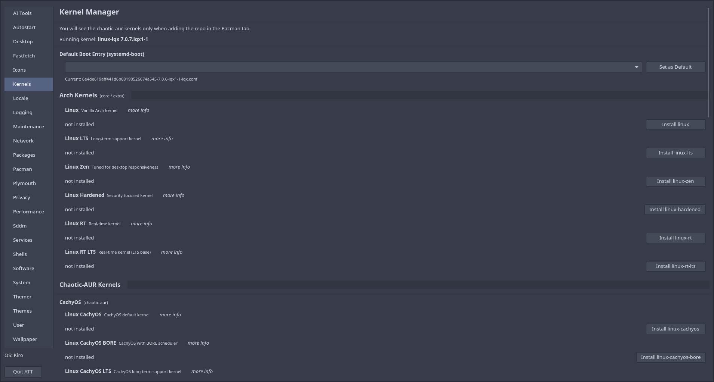 |
| 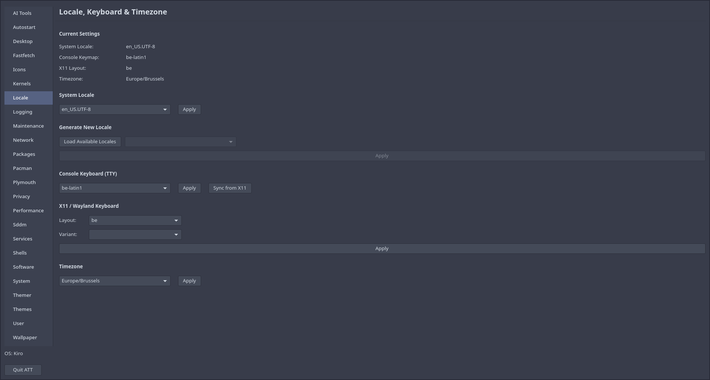 |  | 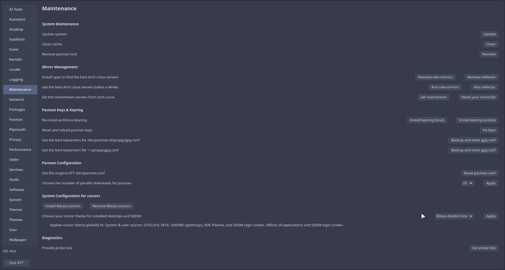 |
| 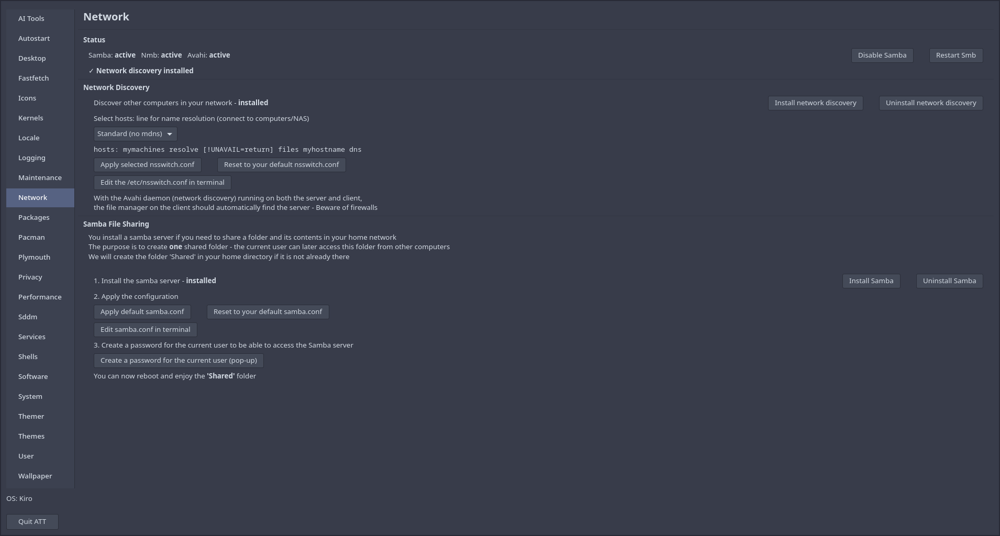 | 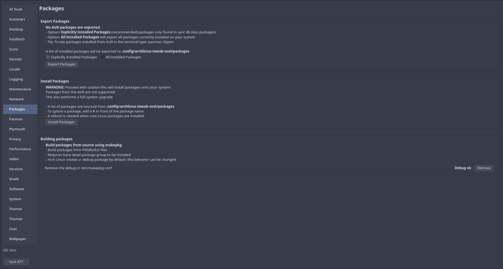 | 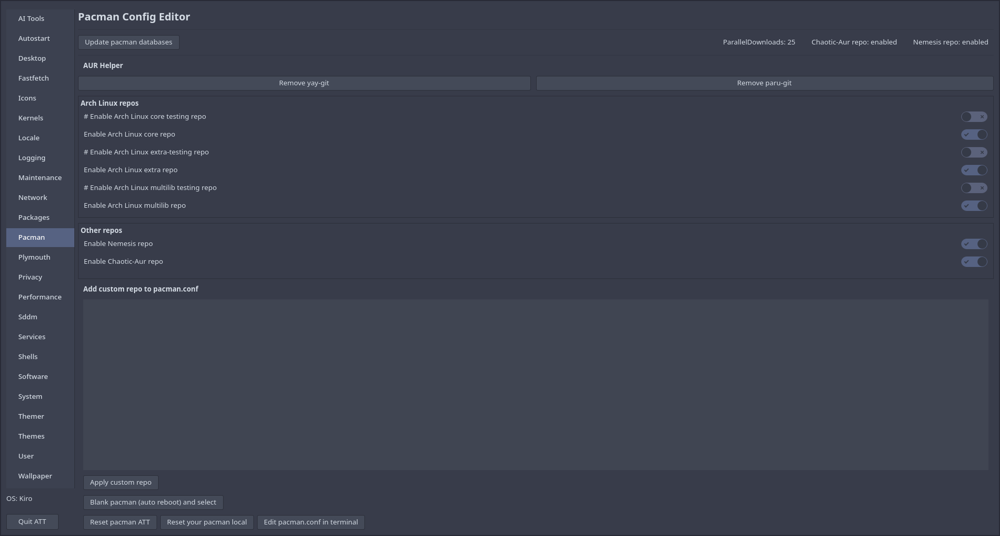 |

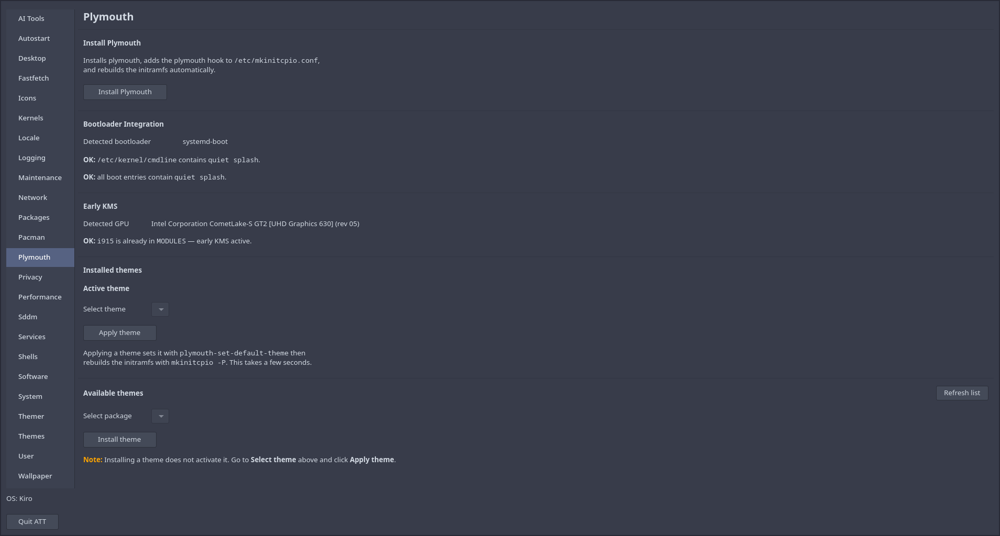

*Above: ArchLinux Tweak Tool interface in action.*

## Overview

ArchLinux Tweak Tool (ATT) is a GTK4-based desktop application designed to simplify system administration and customization for Arch-based Linux distributions. Originally developed for ArcoLinux, ATT now supports numerous Arch-based systems and provides a unified interface for managing various aspects of your Linux system through a graphical user interface.

The tool is written in Python with GTK4 and is built with extensibility and user-friendliness in mind, allowing both novice and experienced users to manage their systems efficiently.

## Key Features

### 🎨 Appearance & Themes

- Install and manage GTK themes
- Configure icon themes
- Customize application appearance
- Preview themes before applying

### 🖥️ Desktop Management

- Manage wallpapers and desktop backgrounds
- Configure desktop environments
- Support for multiple desktop managers (SDDM, LightDM, LXDM)
- Desktop environment-specific settings

### 📦 Package Management

- Export and import installed packages
- Batch package installation from saved configurations
- Pacman configuration and mirror selection
- Package list management

### 🔧 System Configuration

- **Pacman Configuration**: Manage pacman.conf settings and mirror lists
- **User Management**: Create and configure user accounts
- **Shell Configuration**: Set default shells and configure shell environments
- **Zsh Theme Management**: Customize Zsh themes and plugins
- **Services**: Enable/disable system services
- **Autostart Applications**: Manage startup applications

### 🚀 Performance & Optimization

- Performance tuning options
- System optimization settings
- Service management for better resource utilization

### 🔒 Privacy & Security

- hBlock integration for DNS-based ad blocking
- Privacy-focused system configuration

### 🔧 System Maintenance

- Clear orphaned packages
- Find and set best pacman mirrors
- Remove pacman lock files
- System cleanup utilities
- Login manager configuration tools

### 📊 System Information

- FastFetch configuration for system information display
- System profile customization

## Supported Distributions

ATT originally developed for **ArcoLinux**, now supports numerous Arch-based distributions:

| Distribution          | Website                       |
|-----------------------|-------------------------------|
| Arch Linux            | https://archlinux.org         |
| ArchBang              | https://archbang.org/         |
| Archcraft             | https://archcraft.io/         |
| Archman               | https://archman.org/          |
| Artix                 | https://artixlinux.org/       |
| Axyl                  | https://axyl-os.github.io/    |
| BerserkerOS           | https://berserkarch.xyz/      |
| BigLinux              | https://www.biglinux.com.br/  |
| BlendOS               | https://blendos.co/           |
| Bluestar              | https://sourceforge.net/projects/bluestarlinux/ |
| CachyOS               | https://cachyos.org/          |
| Calam-arch            | https://sourceforge.net/projects/blue-arch-installer/ |
| Crystal Linux         | https://getcryst.al/          |
| EndeavourOS           | https://endeavouros.com/      |
| Garuda                | https://garudalinux.org/      |
| Liya                  | https://sourceforge.net/projects/liya-2024/ |
| LinuxHub Prime        | https://linuxhub.link/        |
| Mabox                 | https://maboxlinux.org/       |
| Manjaro               | https://manjaro.org/          |
| Nyarch                | https://nyarchlinux.moe/      |
| ParchLinux            | https://parchlinux.ir/        |
| PrismLinux            | https://www.prismlinux.org/   |
| RebornOS              | https://rebornos.org/         |
| StormOS               | https://sourceforge.net/projects/hackman-linux/ |
| XeroLinux             | https://xerolinux.xyz/        |

**Note:** The complete and up-to-date list of supported distributions is maintained in the source code at the beginning of `archlinux-tweaktool.py` file, as new distributions are regularly added during development.

## Desktop Environment Support

ATT works with virtually all Arch-based desktop environments, including:
- **X11 Desktop Environments**: KDE Plasma, GNOME, Xfce, LXQt, MATE, Cinnamon, and others
- **Wayland Desktop Environments**: Hyprland, Sway, GNOME (Wayland), KDE Plasma (Wayland), and others

## System Management & Backup

ATT implements automatic backup functionality for system safety:
- Configuration file changes are backed up with `.bak` or `.back` extensions
- Reset buttons utilize backup files to restore previous configurations
- Manual backups can be created before major changes

## Advanced Configuration

### Login Manager Configuration

ATT provides specialized configuration tools for common login managers:

- **SDDM**: Simple Display Manager configuration
- **LightDM**: Lightweight login manager
- **LXDM**: LXDE login manager

Automated fix scripts are available if issues occur:

- `fix-sddm-conf`
- `fix-lightdm-conf`
- `fix-lxdm-conf`

### Repository Management

ATT allows you to configure additional package repositories, but caution is recommended as incompatible repositories can cause system conflicts. Always review repository settings carefully before enabling them.

## Requirements

- **Operating System**: Arch Linux or Arch-based distribution
- **Python**: Python 3.x
- **GUI Library**: GTK 4.0
- **Package Manager**: pacman

## Installation

Detailed installation instructions are available in the project's documentation or can be found in the respective distribution's repository.

## Support & Documentation

- **GitHub Repository**: [github.com/erikdubois/archlinux-tweak-tool-gtk4](https://github.com/erikdubois/archlinux-tweak-tool-gtk4)
- **Issue Tracker**: Report bugs and request features on the GitHub repository
- **YouTube Tutorials**: [ArchLinux Tweak Tool Playlist](https://www.youtube.com/playlist?list=PLlloYVGq5pS5nvFc_LYRE82Gh3XWA6rVH)

## Authors

- **Brad Heffernan**
- **Erik Dubois**
- **Cameron Percival**

## Contributing

Contributions are welcome! If you encounter issues or want to add support for additional distributions or features, please:
1. Check the GitHub repository for existing issues
2. Create a detailed bug report or feature request
3. Submit pull requests with improvements

## License

Please refer to the LICENSE file in the repository for licensing information. 

---

**Note**: This tool requires administrative privileges (sudo/pkexec) to modify system configurations. Always ensure you understand the changes being made to your system configuration.